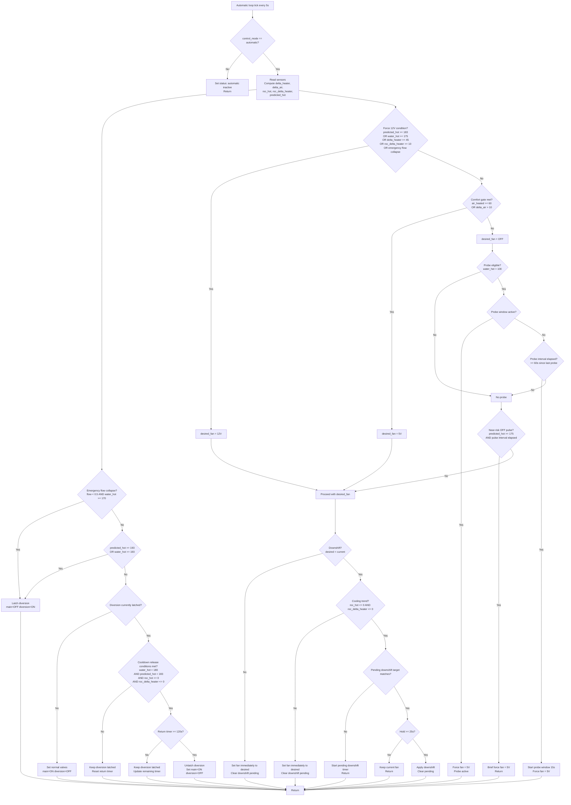

# Automatic Mode Flowchart

Decision-tree view of the `automatic` control loop in `shopheater3000.py` (runs every 5 seconds).

## Notes

- This diagram reflects threshold values currently in code (`183F`, `193F`, etc.).
- The fan probe pulse exists to keep `delta_air` measurable when comfort logic would otherwise keep fans OFF.
- In automatic mode, direct manual fan/valve commands are ignored server-side.
